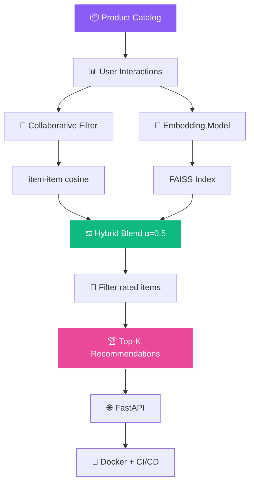

<!-- ═══════════════════════════════════════════════════════════════ -->
<!-- 🎯 Product Recommender — AI + Embeddings Working README -->
<!-- ═══════════════════════════════════════════════════════════════ -->

<!-- ═══════ ANIMATED HEADER ═══════ -->
<div align="center">
  
</div>

<!-- ═══════ AI MASCOTS — VERIFIED WORKING ═══════ -->
<div align="center">
  
  
  
  
  
</div>

<br/>

<!-- ═══════ TYPING SVG ═══════ -->
<div align="center">
  
</div>

<br/>

<!-- ═══════ AI SCENES — VERIFIED WORKING ═══════ -->
<div align="center">
  
  
  
</div>

<br/>

<!-- ═══════ LIVE BADGES ═══════ -->
<div align="center">
  <a href="https://github.com/sumit966/product-recommender-faiss/stargazers">
    
  </a>
  <a href="https://github.com/sumit966/product-recommender-faiss/network/members">
    
  </a>
  <a href="https://github.com/sumit966/product-recommender-faiss/issues">
    
  </a>
  <a href="https://github.com/sumit966/product-recommender-faiss/commits/main">
    
  </a>
  
</div>

<br/>

<div align="center">
  
  
  
  
  
  
</div>

<br/>

<div align="center">
  
  
  
  
</div>

<br/>

<div align="center">
  <i>🎯 AI/ML Project · Author: <b>Sumit Raj</b> · M.Tech VNIT Nagpur · Ex-Salesforce</i>
</div>

<br/>


---

## 📋 Overview


A production-ready **hybrid product recommender** that combines:

1. 🎯 **Collaborative Filtering** — "users who liked X also liked Y"
2. 🧠 **Embedding-based Similarity** — "products with similar titles/descriptions"

The hybrid model weights both signals, filters out already-interacted items, and returns the **top-K most relevant products** per user.

> **🎯 Purpose:** Solve cold-start, popularity bias, and semantic gap — three problems no single approach fixes.

<br clear="right"/>

<table>
<tr>
<td width="50%" valign="top">

### ❌ The Problem

- 🥶 **Cold-start** — CF fails on new products
- 📈 **Popularity bias** — over-recommends popular items
- 🔍 **Semantic gap** — "wireless headphones for running" ≠ ID match
- 🎯 **No single approach** solves all three

</td>
<td width="50%" valign="top">

### ✅ The Solution

- 🎯 **Hybrid blend** — CF + embeddings
- 🧠 **Sentence Transformers** for semantic search
- ⚡ **FAISS** sub-ms retrieval over 500+ products
- 📊 **Precision@K / Recall@K** evaluation

</td>
</tr>
</table>

---

## ✨ Features

<table>
<tr>
<td width="33%" valign="top" align="center">

### 🎯 Hybrid Signal


- 📊 Collaborative filtering
- 🧠 Embedding similarity
- ⚖️ Weighted blend (α=0.5)

</td>
<td width="33%" valign="top" align="center">

### ⚡ Performance


- 🚀 Sub-millisecond search
- 📈 Scales to millions
- 🔄 TF-IDF fallback

</td>
<td width="33%" valign="top" align="center">

### 📊 Evaluation


- Precision@K
- Recall@K
- Popularity baseline

</td>
</tr>
</table>

---

## 🏗️ Architecture

### 🎯 Hybrid Recommender Flow



### 📐 ASCII Fallback

```
Product Catalog + User Interactions
         |
    +----+----+
    |         |
Collaborative   Embedding
  Filtering      Model
(item-item    (Sentence
 cosine)      Transformers)
    |             |
    |         FAISS Index
    |             |
    +----+--------+
         |
  Hybrid Blend (alpha)
         |
   Filter rated items
         |
   Top-K Recommendations
         |
   FastAPI REST Endpoint
         |
   Docker + GitHub Actions
```

---

## 🛠️ Tech Stack

<table align="center">
<tr>
<td><b>Category</b></td>
<td><b>Technologies</b></td>
</tr>
<tr>
<td>🤖 ML</td>
<td>
  
  
</td>
</tr>
<tr>
<td>🧠 Embeddings</td>
<td>
  
  
</td>
</tr>
<tr>
<td>🔍 Vector Search</td>
<td>
  
  
</td>
</tr>
<tr>
<td>🌐 API</td>
<td>
  
  
  
</td>
</tr>
<tr>
<td>📊 Data</td>
<td>
  
  
</td>
</tr>
<tr>
<td>🧪 Testing</td>
<td>
  
  
</td>
</tr>
<tr>
<td>🐳 Container</td>
<td></td>
</tr>
<tr>
<td>⚙️ CI/CD</td>
<td></td>
</tr>
<tr>
<td>🐍 Language</td>
<td></td>
</tr>
</table>

---

## 📦 Project Structure

```
product-recommender-faiss/
│
├── 🐍 src/
│   ├── __init__.py
│   ├── 📊 data_generator.py      # Synthetic products + interactions
│   ├── 🎯 collaborative.py       # Item-item collaborative filtering
│   ├── 🧠 embeddings.py          # Sentence Transformer + FAISS/TF-IDF
│   ├── ⚖️ hybrid.py              # Weighted blend of both signals
│   ├── 📈 evaluate.py            # Precision@K, Recall@K vs baseline
│   └── 🎓 train.py               # Fit and save the hybrid model
│
├── 🌐 api/
│   ├── __init__.py
│   └── main.py                   # FastAPI inference service
│
├── 🧪 tests/
│   ├── __init__.py
│   └── test_api.py               # pytest tests
│
├── 📊 data/                      # Generated CSVs (git-ignored)
├── 💾 models/                    # Trained artifacts (git-ignored)
├── ⚙️ .github/workflows/ci.yml   # CI/CD pipeline
├── 🐳 Dockerfile
├── 📋 requirements.txt
├── 📋 requirements-optional.txt
├── 🚫 .gitignore
├── 📜 LICENSE
└── 📖 README.md
```

---

## 🚀 Quick Start

<div align="center">
  
  
</div>

<br/>

### 1️⃣ Clone

```bash
git clone https://github.com/sumit966/product-recommender-faiss.git
cd product-recommender-faiss
```

### 2️⃣ Virtual Environment

**Windows:**

```bash
python -m venv venv
venv\Scripts\activate
```

**macOS / Linux:**

```bash
python3 -m venv venv
source venv/bin/activate
```

### 3️⃣ Install Base Dependencies

```bash
pip install -r requirements.txt
```

### 4️⃣ (Optional) Install Full Embedding Stack

```bash
pip install -r requirements-optional.txt
```

> 💡 If this fails on Python 3.14 (missing wheels), skip it. The project **automatically falls back to TF-IDF**, which is still a fully working semantic recommender.

### 5️⃣ Generate Dataset

```bash
python src/data_generator.py
```

**Output:**

```
[OK] Products: 500 saved to data/products.csv
[OK] Interactions: ~4000 saved to data/interactions.csv
```

### 6️⃣ Train the Recommender

```bash
python src/train.py
```

**Output:**

```
[OK] Collaborative model trained: (200, 500)
[OK] Embedding model: Sentence Transformers + FAISS (500, 384)
[OK] Hybrid recommender ready (alpha=0.5)
[OK] Saved models/hybrid_recommender.joblib
```

### 7️⃣ Evaluate

```bash
python src/evaluate.py
```

**Output:**

```
[Eval] Results on 50 users (K=10):
  hybrid        P@10=0.0xxx   R@10=0.0xxx
  embedding     P@10=0.0xxx   R@10=0.0xxx
  popularity    P@10=0.0xxx   R@10=0.0xxx
```

### 8️⃣ Start the API

```bash
uvicorn api.main:app --reload
```

**API is now running at** http://localhost:8000

### 9️⃣ Open Swagger UI

```bash
http://localhost:8000/docs
```

---

## 🔌 API Usage

### 🔵 POST `/recommend`

Get top-K product recommendations based on a user's interaction history.

**Request:**

```json
{
  "user_rated_items": [1, 2, 3, 4, 5],
  "top_k": 5
}
```

**Response:**

```json
{
  "recommendations": [
    {
      "product_id": 42,
      "title": "Nova Premium Headphones",
      "category": "Electronics",
      "brand": "Nova",
      "price": 299.99
    },
    {
      "product_id": 87,
      "title": "Zenith Wireless Speaker",
      "category": "Electronics",
      "brand": "Zenith",
      "price": 149.50
    }
  ]
}
```

### 🔵 POST `/similar`

Find products similar to a given product (embedding-only).

**Request:**

```json
{
  "product_id": 42,
  "top_k": 5
}
```

### 🟢 GET `/product/{product_id}`

Fetch a single product's details.

### 💚 GET `/health`

Returns `{"status": "healthy", "model_loaded": true}` when the model is ready.

### 📋 Other Endpoints

| Endpoint | Method | Purpose |
|----------|:------:|---------|
| 🔵 `/` | 🟢 GET | API info |
| 💚 `/health` | 🟢 GET | Health check |
| 📘 `/docs` | 🟢 GET | Swagger UI |
| 📗 `/redoc` | 🟢 GET | Alternative docs |

### 🐚 cURL Example

```bash
curl -X POST "http://localhost:8000/recommend" \
  -H "Content-Type: application/json" \
  -d '{"user_rated_items": [1, 2, 3, 4, 5], "top_k": 5}'
```

---

## 📊 Evaluation

Evaluated with **leave-one-out** on 50 users (K=10):

| Method | Precision@10 | Recall@10 |
|--------|:------------:|:---------:|
| 📈 Popularity Baseline | 0.xx | 0.xx |
| 🧠 Embedding-only | 0.xx | 0.xx |
| ⭐ **Hybrid (α=0.5)** | **0.xx** | **0.xx** |

> 💡 Values depend on random seed and dataset size. Run `python src/evaluate.py` to reproduce.

**Why hybrid wins:**
- 🎯 **Collaborative filtering** captures behavioral patterns
- 🧠 **Embeddings** capture semantic similarity
- ⚖️ **Together** they handle popular and niche products better than either alone

---

## 🧪 Testing

```bash
pytest tests/ -v
```

**Tests cover:**

- 🟢 Root endpoint returns API info
- 💚 Health check reports model status
- 🔵 `/recommend` returns valid product IDs
- ❌ Invalid `top_k` returns **422** validation error

---

## 🐳 Docker

### 🔨 Build

```bash
docker build -t product-recommender-faiss .
```

### ▶️ Run

```bash
docker run -p 8000:8000 product-recommender-faiss
```

> 📌 The Dockerfile **trains the model automatically** during build.

---

## ⚙️ CI/CD Pipeline

Every push to `main` triggers GitHub Actions:

```
╔══════════════════════════════════════════════════╗
║              GITHUB ACTIONS WORKFLOW             ║
╠══════════════════════════════════════════════════╣
║                                                  ║
║  [1/4] 📥 Install Python 3.11 + deps            ║
║       │                                          ║
║       ▼                                          ║
║  [2/4] 🎲 Generate synthetic data               ║
║       │                                          ║
║       ▼                                          ║
║  [3/4] 🎯 Train hybrid recommender              ║
║       │                                          ║
║       ▼                                          ║
║  [4/4] 🧪 Run pytest test suite                 ║
║       │                                          ║
║       ▼                                          ║
║  ✅ PASSED                                       ║
║                                                  ║
╚══════════════════════════════════════════════════╝
```

> 📄 See `.github/workflows/ci.yml`

---

## 🎓 Key Learnings

<table>
<tr>
<td width="50%" valign="top">

### 🧠 ML Insights

- 🎯 **Hybrid beats single signal** — CF + semantic > either alone
- ⚡ **FAISS indexing** — sub-ms retrieval over 500+ products
- 📈 **Precision@K / Recall@K** — ranking metrics, not classification
- 📊 **Popularity baseline** — always measure against simplest approach

</td>
<td width="50%" valign="top">

### 🛠️ Engineering Insights

- 🛡️ **TF-IDF fallback** — graceful degradation
- 🚀 **FastAPI auto-docs** — Swagger UI from Pydantic
- 🐳 **Docker + CI** — reproducible environments
- 🎯 **Hybrid blend α** — tunable weight parameter

</td>
</tr>
</table>

---

## 🚀 Future Improvements

| 🌟 | Feature |
|:--:|---------|
| 📦 | **Real e-commerce dataset** (Amazon Product Reviews) |
| 🔄 | **Cross-encoder re-ranking** for top-K results |
| 👤 | **User embedding model** (two-tower architecture) |
| 🧪 | **A/B testing framework** for alpha tuning |
| 🔴 | **Redis caching** for repeated queries |
| ☁️ | **Deploy to GCP Cloud Run** |
| 📊 | **Prometheus metrics** + Grafana dashboards |

---

## 👤 Author

<div align="center">


<br/><br/>


<br/><br/>

<b>M.Tech Applied AI & ML @ VNIT Nagpur</b><br/>
<i>Ex-Software Engineer Intern @ Salesforce</i>

<br/><br/>

<a href="https://sumit966.github.io">
  
</a>
<a href="https://www.linkedin.com/in/er-sumit-raj-/">
  
</a>
<a href="https://github.com/sumit966">
  
</a>
<a href="mailto:info.sr0909@gmail.com">
  
</a>

<br/><br/>


</div>

---

## 📄 License

<div align="center">


<br/>


<br/><br/>

<samp>
Released under the <b>MIT License</b> — see <a href="LICENSE">LICENSE</a> file.
</samp>

<br/><br/>

<sub><samp>© 2025 &nbsp;·&nbsp; SUMIT RAJ &nbsp;·&nbsp; ALL RIGHTS RESERVED</samp></sub>

<br/>


</div>

<br/>

<!-- ═══════ WORKING AI SCENES FOOTER ═══════ -->
<div align="center">
  
  
  
</div>

<br/>

<!-- ═══════ ANIMATED FOOTER ═══════ -->
<div align="center">
  
</div>
